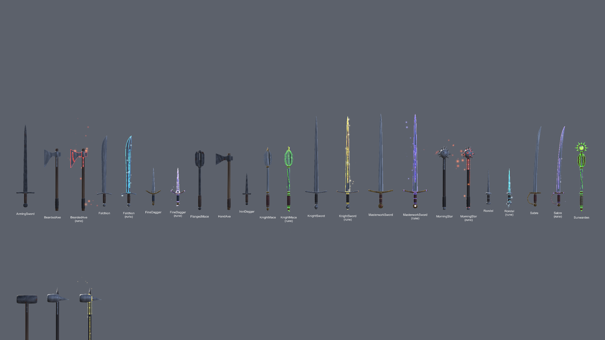
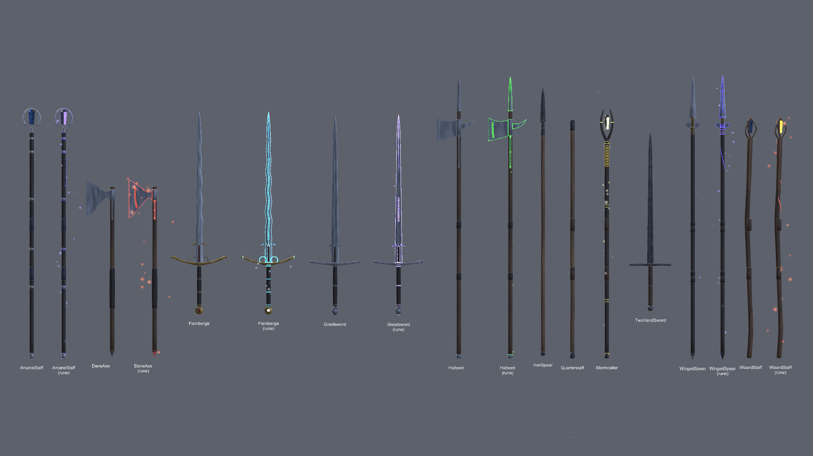
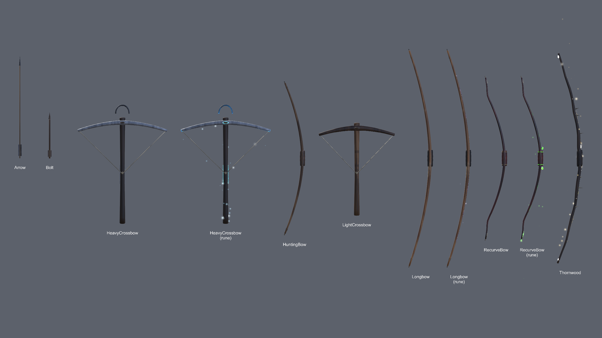
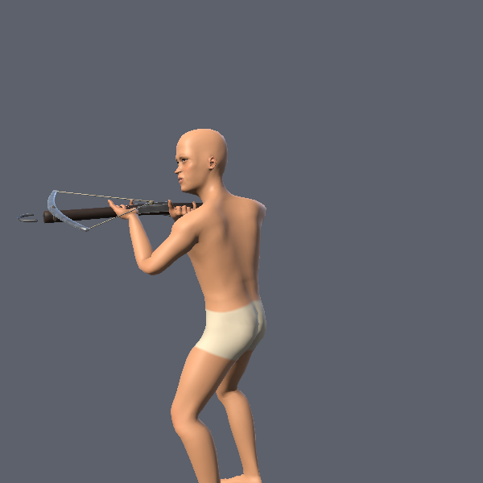
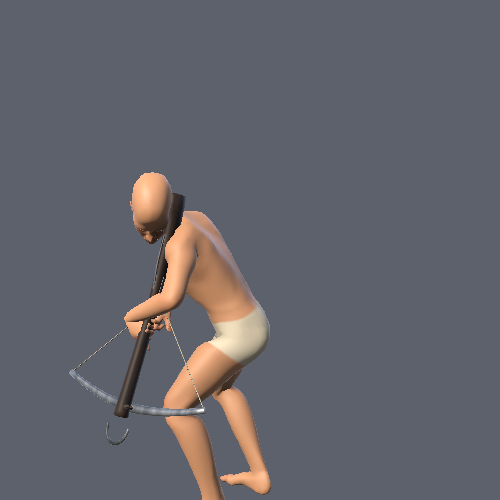

# Weapons

A parametric weapon kit for the RPG (MedievalSetting): 35 models built from code in Blender, 20 of them also in an
enchanted copy whose runes, edges and stones glow, all on one painted atlas. Human-sized, modelled in the goblins'
hand-socket frame, so a goblin can hold them as they are and a human with the game's standard turn.



Blender file: `blender/weapons.blend`, scene **Weapons** (the catalog, rows of every model with its name). Everything
in it is rebuilt from `src/`.

## Rebuild

In Blender (Python console or the MCP):

```python
import sys; sys.path.insert(0, r"E:\Unity\Projects\GameArtGeneration\Weapons\src")
import wpn_build, wpn_bake, wpn_export
wpn_build.build_all()                                    # every model into WPN_Export + the catalog (~10 s)
wpn_bake.bake_all(passes=("color",))                     # packs the UVs, bakes the colour atlas (~70 s on the GPU)
wpn_bake.bake_all(passes=("glow",), pack_uvs=False)      # the glow mask on the same layout
wpn_bake.bake_all(passes=("ms",), pack_uvs=False)        # metallic / smoothness
wpn_export.export_all()                                  # export/Models/*.fbx, export/weapons.json, export/Textures
```

The bake is split in three calls because one long call times the MCP connection out (the bake still finishes). Bake
with Cycles on the GPU: the user preference `compute_device_type` is NONE by default on this machine; set OPTIX for the
bake and back to NONE after (that is what was done so far). The painted source materials stay on the objects after a
bake, so one pass can be baked again without a rebuild.

| Script | Does |
|---|---|
| `wpn_common.py` | lofted tubes, flat slabs, boxes, rings, UVs laid out as parts are built (adapted from the goblins') |
| `wpn_mats.py` | painted source materials (`PALETTE`: colours, wear, glow, metallic, smoothness), the rune glyph strip, the three bake passes |
| `wpn_parts.py` | parts: blades with real sections (bevelled edges, fullers, midribs, single edge, curve, belly, flamberge waves), guards, grips, pommels, hafts, langets, flanges, spikes, hammer blocks, crystals, rune inlays |
| `wpn_roster.py` | one builder per model and the `WEAPONS` list (name, builder, hand, mode) |
| `wpn_build.py` | builds every model, finishes the meshes (sharp edges over 75 degrees), lays out the catalog |
| `wpn_bake.py` | packs one atlas and bakes colour, glow and metallic/smoothness |
| `wpn_export.py` | one FBX per model (one material, one submesh) and the manifest |
| `wpn_scene.py` | review renders of catalog rows (`render(path, cat([...]))`) |

## The roster

| | Iron | Steel | Fine | Enchanted copy |
|---|---|---|---|---|
| Swords | ArmingSword | KnightSword, Falchion | MasterworkSword, Sabre | KnightSword, Falchion, MasterworkSword, Sabre |
| Daggers | IronDagger | Rondel | FineDagger | Rondel, FineDagger |
| Axes | HandAxe | BeardedAxe | | BeardedAxe |
| Maces | FlangedMace | MorningStar | KnightMace | MorningStar, KnightMace |
| Two-handed | TwoHandSword, Maul | Greatsword, WarMaul, DaneAxe | Flamberge | Greatsword, WarMaul, DaneAxe, Flamberge |
| Polearms, staves | IronSpear, Quarterstaff | WingedSpear, Halberd, WizardStaff | ArcaneStaff | WingedSpear, Halberd, WizardStaff, ArcaneStaff |
| Bows | HuntingBow | Longbow | RecurveBow | Longbow, RecurveBow |
| Crossbows | LightCrossbow | HeavyCrossbow | | HeavyCrossbow |
| Named (enchanted only) | | | | Sunwarden (mace), Stormcaller (staff), Thornwood (bow) |
| Missiles | Arrow, Bolt | | | |

Iron is dark and pitted with rust, plain guards; steel is bright with long fullers, curved guards, wire-bound grips;
fine adds gilt or silver fittings, coloured grips and stones. An enchanted copy is the same model plus rune inlays (in
the fuller, along an axe's bit, round a shaft, down a bow's back) and crystals in place of the stones.

Triangles: 112 (arrow) to 1,000-1,800 for most models; the flamberge is the heaviest at 2,640 (3,030 enchanted).
67,684 for all 55. Textures: `T_Weapons` 2048² (colour), `T_Weapons_Glow` 2048² (the glow mask), `T_Weapons_MS` 2048²
(metallic R, smoothness A).

## Socket frame

Every model is built in socket space, the goblins' convention (see Goblins/README): origin where the fist closes,
+Y along the handle toward the business end, the knuckles' side (+X in Blender, -X in Unity) where the edge or the
axe's bit is, +-Z the blade's flat faces.
- **Right-hand weapons** sit in a goblin's `Socket_RightHand` at identity, and in a Humans `Socket_R` turned
  (0, 90, 0), like the goblin props the game already used.
- **The two-handed clips** hold the right fist on top (the left 10-18 cm below it, measured on the Kevin Iglesias
  2H clips), so two-handed grips run down to y = -0.24; the polearm clips hold the left fist 36 cm above the right,
  so polearm heads sit above y = +0.9. The game turns a two-handed prop so its shaft runs through both fists.
- **Bows and crossbows are left-hand props.** A bow is built as the goblin short bow (the stave bowing toward +X, the
  archer; the string between the tips: `string_top` / `string_bottom` in the manifest). A crossbow is built shooting
  along +Y with its top +Z, then turned half a turn about Y (`CROSSBOW_GRIP`) so the left palm cradles the
  fore-stock from below. In a Humans `Socket_L` both turn (0, -90, 0) (checked against the bow clip: at (0, 0, 0)
  the bow is held edge on).
- **Missiles** fly along +Y, the nock at the origin.

## Enchanted models

`T_Weapons_Glow` holds what lights up: the glyph strip on the rune inlays (their own "Rune" UV layer maps them onto
`textures/T_RuneStrip.png`, generated), solid white on crystals, and a faint line along every metal edge. Only the
enchanted models use it (the plain ones use `M_Weapons`, no emission), so the plain ones are not affected by it.

## Unity

Install into MedievalSetting with:

```
powershell -ExecutionPolicy Bypass -File tools\install_to_unity.ps1 -Project E:\Unity\Projects\MedievalSetting
```

then **Tools > Weapons > Rebuild Prefabs and Showcase** (or *Rebuild Prefabs Only*).

| `Assets/Weapons/...` | |
|---|---|
| `Models/` | `Wpn_*.fbx` (Read/Write, no materials, normals as exported: `WeaponsPostprocessor`), `weapons.json` |
| `Textures/`, `Materials/` | the three maps; `M_Weapons` (URP Lit), `M_Weapons_Rune` (the same with the glow map as emission), `M_Weapons_Spark` (additive particles) |
| `Prefabs/Wpn_*` | mesh + material + `WeaponProp` (hand, string tips, bolt rest, length, triangles); enchanted ones also `WeaponGlow` |
| `Scenes/Weapons_Showcase` | every prefab in rows, the enchanted ones cycling the elements; renders to `Logs/WeaponsSetup` |

`WeaponGlow` (runtime): the runes and edges glow and breathe in the element's colour (`MaterialPropertyBlock` on
`_EmissionColor`), a point light goes with them, and particles come off the surface: embers rise from flame, frost motes
drift down, sparks crack off a storm weapon, venom drips, holy and arcane motes float. `Set(Enchant)` changes it at run
time; the game's `PlayerModel` does that from the item's `WeaponEnchant`. Effect objects are named `FX_*` (the goblins'
merge leaves those out).

Gotchas met:
- URP keeps `_EMISSION` on a material only while its GI flags include an emissive one (`BaseShaderGUI` recomputes the
  keyword on import): `M_Weapons_Rune` uses `RealtimeEmissive`.
- Edit-mode renders of new materials can come out empty while their shader variants compile; the setup turns
  asynchronous compilation off for its renders.
- A skinned body sampled with `AnimationMode` renders one sample late unless `forceMatrixRecalculationPerRender` is on.




## In the game

MedievalSetting's `Game > Items > Create Default Items` makes the 54 items from these prefabs (see its
`Assets/Game/README.md`: tiers, prices, enchantments, where each is sold or found). Crossbows have their own clips,
authored on the goblin rig in the Goblins pipeline (`src/gob_crossbow.py`, `Goblin@Crossbow_Ready` / `_Shoot`).

 
